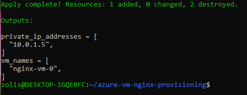
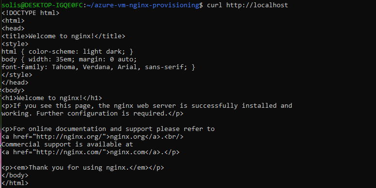

# Project 12 - Azure Linux VM with NGINX Auto-Provisioning

## 📌 Description
This project deploys a Linux VM in Microsoft Azure using Terraform and automatically installs NGINX using a `cloud-init` script (`init.sh`). It demonstrates how infrastructure and basic service provisioning can be automated together.

---

## 🧰 Technologies Used

- Terraform
- Microsoft Azure
- Ubuntu Server 18.04
- NGINX
- Cloud-init (`custom_data`)
- Azure CLI

---

## 🚀 How to Deploy

```bash
az login
terraform init
terraform apply -auto-approve
```

---

## 🧪 How to Verify

SSH into the VM (if applicable), or use cloud shell and run:

```bash
curl http://localhost
```

You should see the default NGINX welcome page HTML.

---

## 📸 Screenshots

### ✅ 1. Terraform Apply Output

This confirms successful deployment and shows the private IP and VM name output:



---

### ✅ 2. NGINX Running Inside the VM

This screenshot shows the `curl http://localhost` response, proving that NGINX was successfully installed during provisioning:



---

## 📂 Project Folder Structure

```bash
azure-vm-nginx-provisioning/
├── main.tf
├── outputs.tf
├── init.sh
├── .gitignore
├── README.md
└── screenshots/
    ├── terraform-apply-success.png
    └── nginx-running.png
```

---

## 👤 Author

**Anthony Solis**  
[GitHub: ASolis2](https://github.com/ASolis2)

---

